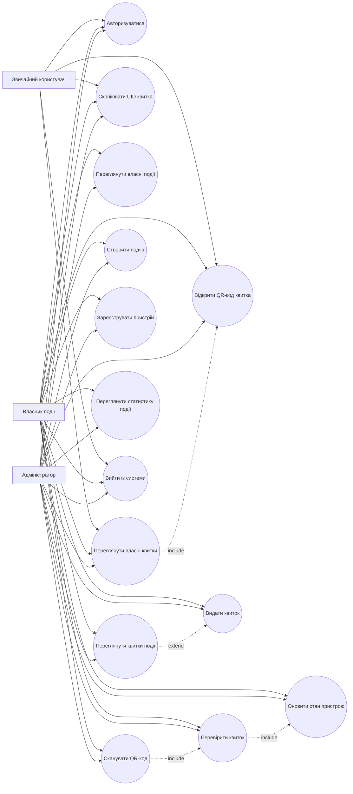
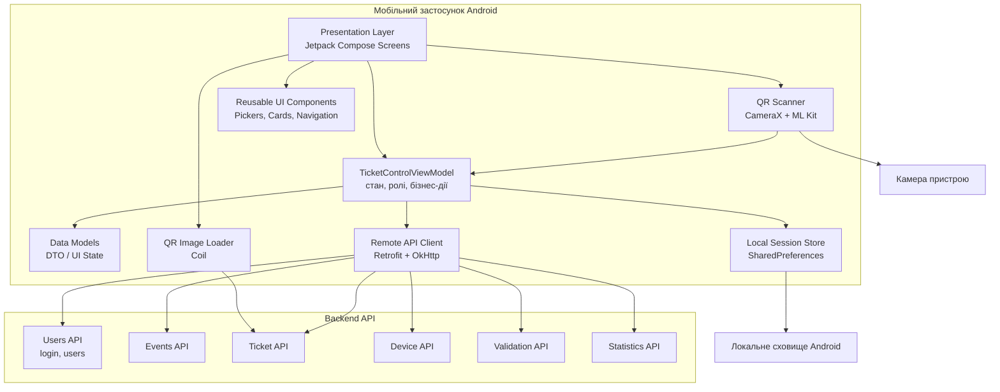
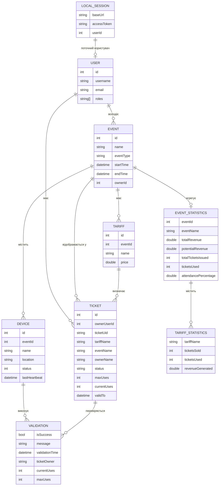
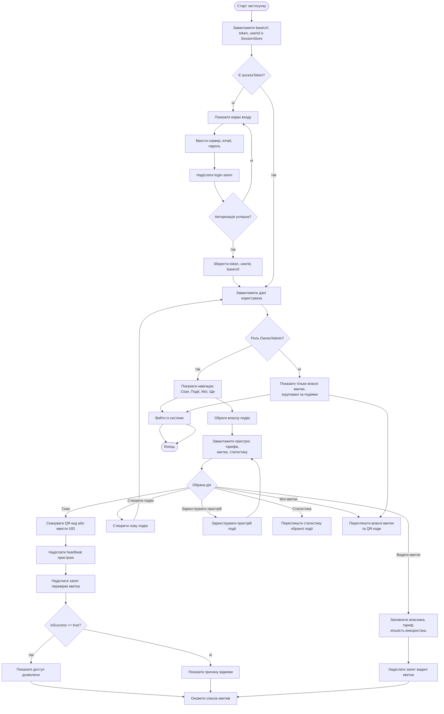

# UML та ER-діаграми мобільного застосунку Ticket Control

## UML Діаграма Прецедентів

## UML Діаграма Компонентів

## ER-Модель Даних Мобільної Платформи

Мобільний застосунок не має власної реляційної БД. Постійно локально зберігається лише сесія користувача, а доменні сутності синхронізуються через REST API та живуть у стані застосунку.

## UML Діаграма Діяльності

## Опис Прийнятих Інженерних Рішень

Мобільний застосунок реалізовано на стеку `Kotlin + Jetpack Compose` з поділом на шари даних, віддаленої взаємодії та представлення. Для роботи з API використано `Retrofit` і `OkHttp`, для керування станом — `ViewModel` та єдиний `UiState`, а для QR-сканування — `CameraX` разом із `ML Kit`. Така структура дозволила відокремити мережеву логіку від інтерфейсу, спростити підтримку коду та зробити поведінку екранів передбачуваною.

Інтерфейс побудовано з урахуванням ролей користувачів: звичайний користувач бачить лише власні квитки та QR-коди, тоді як Owner і Admin отримують доступ до сканування, керування власними подіями, пристроями, видачі квитків і статистики. Для зручності мобільної взаємодії події та квитки об’єднано в один сценарій перегляду, а широку верхню навігацію замінено нижньою панеллю. Додатково враховано серверну модель heartbeat для пристроїв контролю та окрему обробку бізнес-результату `isSuccess`, що дає змогу коректно відображати як успішні перевірки, так і причини відмови.
